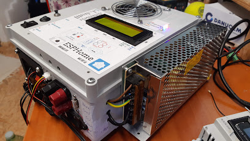

# UPS-ESPHOME

Druhý prototyp hybridného meniča pre domáce použitie do 5A odberu.

- moje použitie je komplet pohon inteligentnej domácnosti (rpi/xiami gateway/ 5 kamier / modem a router / tvbox / magio box / led strip / + ďalsie veci

Možnosti:
- nabijanie vybijanie olovennej baterie
- automaticke odpojenie baterie pri nízkom napatí a prepnutie na sieť bez oneskorenia
- kompletne meranie
- regulacia nabíjania
- všetko chránné poistkami a ventilátorom

Max výstup:
Snažil som sa to konfigurovať na 5A ale nemám ich relane odskúšaných.
